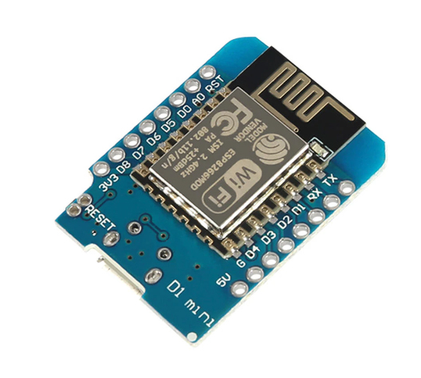
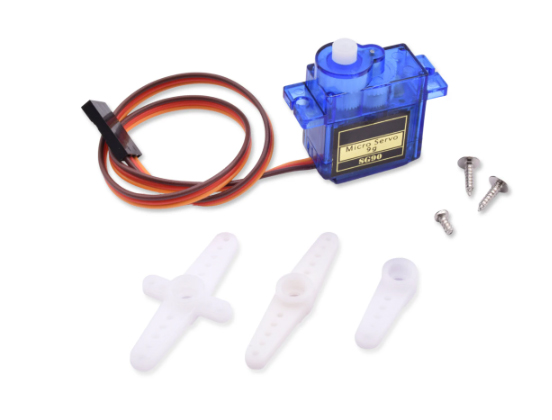
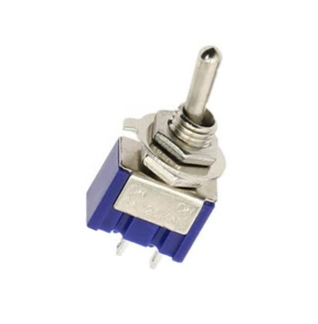
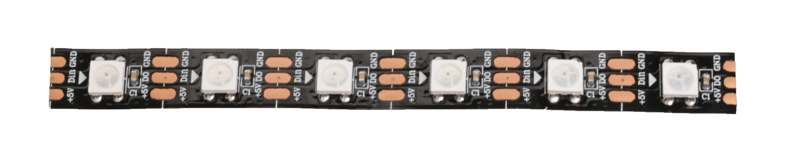
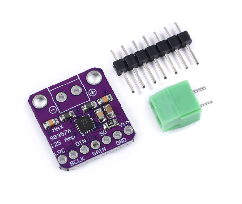
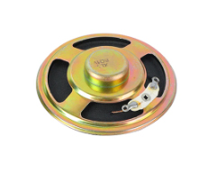

# uselessbox
Useless box - box closes itself after opening by switch

Project is about a so-called useless box. The box has a switch in front. If you flip the switch up, the lid of the box opens and an arm comes out that puts the switch to off position.
And then the arm goes back and the box closes again.

The following hardware is used:

1) ESP8266 controller (D1 mini or similar

2) Two small RC servos, one for the lid and one for the arm

3) A toggle switch

4) A small piece of ledstrip with 6 pixel leds (2812)

5) A small audio amplifier

6) A small loudspeaker

Load files into the Arduino IDE and save as a new sketch.

